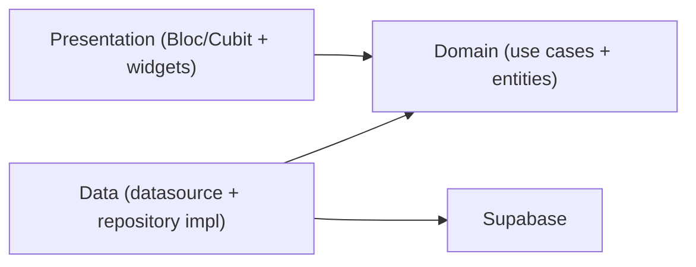

# Flutter Supabase Starter

A production-leaning starter for building Flutter apps on Supabase. It ships with
email/password and Google authentication, session-aware routing, and a sample
database feature, all organized with feature-first Clean Architecture.

## Features

- Email/password sign in and sign up with client-side validation
- Google OAuth via deep link redirect
- Session persistence and reactive auth state through `onAuthStateChange`
- Route guards with `go_router` that redirect based on auth state
- Sample `profiles` feature demonstrating Supabase Database access with Row Level Security
- Sample `tasks` to-do feature demonstrating per-user CRUD with RLS and FK indexing
- Clean Architecture (data / domain / presentation) organized by feature
- `flutter_bloc` for state, `get_it` for DI, `dartz` for functional error handling

## Prerequisites

- Flutter SDK (Dart `^3.5.4`)
- A [Supabase](https://supabase.com) project

## Quick start

1. Install dependencies:

   ```bash
   flutter pub get
   ```

2. Create your local environment file from the example and fill in your project
   credentials (Supabase Dashboard -> Project Settings -> API):

   ```bash
   cp env.example.json env.json
   ```

   ```json
   {
     "SUPABASE_URL": "https://your-project-ref.supabase.co",
     "SUPABASE_PUBLISHABLE_KEY": "your-publishable-or-anon-key"
   }
   ```

   `env.json` is gitignored. Never commit real keys.

3. Run the app, passing the env file:

   ```bash
   flutter run --dart-define-from-file=env.json
   ```

   VS Code users can simply press F5 — the included `.vscode/launch.json` already
   passes the env file.

The app calls `Environment.validate()` at startup and fails fast with a clear
message if `SUPABASE_URL` or `SUPABASE_PUBLISHABLE_KEY` are missing.

## Database setup

Apply the included migrations to create the `profiles` and `tasks` tables with
Row Level Security policies. The profiles migration also adds a trigger that
auto-creates a profile row on sign up.

Using the Supabase CLI:

```bash
supabase db push
```

Or copy the SQL files from [`supabase/migrations/`](supabase/migrations/) into
the Supabase Dashboard SQL editor and run them in order:

1. [`20250619000000_create_profiles.sql`](supabase/migrations/20250619000000_create_profiles.sql)
2. [`20250619100000_create_tasks.sql`](supabase/migrations/20250619100000_create_tasks.sql)

## Google OAuth setup

1. In the Supabase Dashboard, go to **Authentication -> Providers -> Google** and
   enable it with your Google OAuth client ID and secret.
2. Go to **Authentication -> URL Configuration** and add the redirect URL:

   ```
   com.example.flutter_supabase_starter://login-callback
   ```

3. The deep link scheme is already registered natively:
   - Android: `<intent-filter>` in [`android/app/src/main/AndroidManifest.xml`](android/app/src/main/AndroidManifest.xml)
   - iOS: `CFBundleURLTypes` in [`ios/Runner/Info.plist`](ios/Runner/Info.plist)

If you change the app's bundle identifier, update the scheme in all three places
(the two native files above and `Environment.oauthRedirectUrl`) so they match.

## Architecture

The project follows feature-first Clean Architecture. Dependencies point inward:
presentation depends on domain, data depends on domain, and domain depends on
nothing framework-specific.

```
lib/
├── config/            # Environment configuration
├── core/              # DI, router, error types, use case base
├── features/
│   ├── auth/          # data / domain / presentation
│   ├── profile/       # data / domain / presentation (read-only DB example)
│   └── tasks/         # data / domain / presentation (CRUD + RLS example)
├── utils/             # App initialization
├── app.dart           # Root widget and AuthBloc scope
└── main.dart          # Bootstrap sequence
```

Each feature is a vertical slice:



## Extending the app

To add a feature, copy the structure of an existing slice (`features/auth`,
`features/profile`, or `features/tasks`):

1. Define the entity, repository contract, and use cases in `domain/`.
2. Implement the model, remote data source, and repository in `data/`.
3. Build the Cubit/Bloc and pages in `presentation/`.
4. Register dependencies in a `di/<feature>_injection.dart` and call it from
   [`lib/core/di/injection.dart`](lib/core/di/injection.dart).

## Testing

```bash
flutter test
```

The suite covers `AuthValidators`, `AuthBloc` sign-in flows, and `TasksCubit`
load/create paths using `bloc_test` and `mocktail`.
